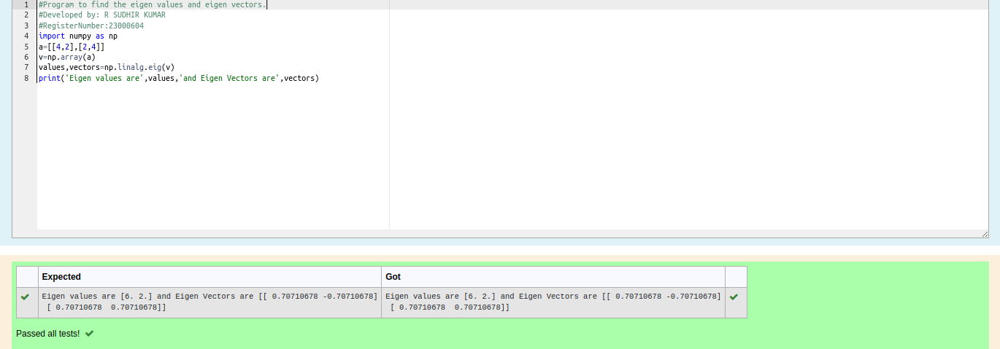

# EIGENVALUES-AND-EIGENVECTORS
## Aim:
To write a python program to find the Eigenvalues and Eigen Vectors
## Equipment’s required:
1. 	Hardware – PCs
2. 	Anaconda – Python 3.7 Installation / Moodle-Code Runner
## Algorithm:
### Step1 : 
Import the module
### Step 2: 
Prepare the lists from each linear equations and assign as an array
### Step 3: 
Using the np.linalg.eig(),  we get two results (first is eigenvalue and second is eigenvector) of the given matrix.
### Step 4: 
End the program

## Program:
```python
#Program to find the eigen values and eigen vectors.
#Developed by: R SUDHIR KUMAR
#RegisterNumber:23000604
import numpy as np
a=[[4,2],[2,4]]
v=np.array(a)
values,vectors=np.linalg.eig(v)
print('Eigen values are',values,'and Eigen Vectors are',vectors)
```
## Output:

## Result:
Thus the Eigenvalue and Eigenvector is successfully solved using python program
